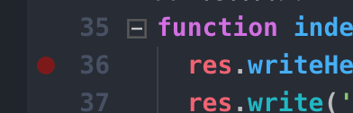

# 首个 Node 应用

Node 现在已经是前端的必备技能之一了，本系列教程将针对做 Node web 开发需要用到的一些技巧，知识通过一系列的实战来层层递进。希望对你们有帮助。

## 准备工作

安装 Node ，直接在官方[下载](https://nodejs.org/en/download/)当前最新的 LTS 版本即可，安装好之后执行

```bash
$ node -v
```

如果能正确展示出版本号，说明 Node 已经安装成功，当 Node 安装成功后，也自动会装上 Node 的包管理器 `npm`。

然后新建一个目录叫 `myProject`，接下来的 demo 都在该项目下执行即可，进入该目录后再执行一下以下命令

```bash
$ npm init
```

然后可以一直回车到运行退出，可以看到目录下多了个文件 `package.json` ，这个是 Node 项目的描述文件，项目中用到的依赖等都会在该项目中。

## Node HTTP 服务

### 创建服务

安装好 Node 之后，就可以开始用 Node 写一个 `http` 服务了。在 `myProject` 中新建个文件 `httptest.1.js` 写入以下代码，代码的每一行是干什么的，基本上注释上都已经写清楚了。

```js
// 我们引入 http 模块
const http = require('http');

// 通过 createServer 创建一个 server 对象
const server = http.createServer((req, res) => {
  // 当用户请求过来的时候都会触发该回调
  // req 是请求对象，res 是响应对象
  res.writeHead(200); // 写响应码为 200 ，代表响应成功
  res.write('hello nodejs'); // 往响应里写字符串
  res.end(); // 完成响应
});

// 监听 3000 端口
server.listen(3000, () => {
  // 服务启动完成的时候会触发该回调，打印日志
  console.info('server listening in', server.address().port);
});
```

然后我们执行一下

```bash
$ node httptest
```

可以看到控制台会输出 `server listening in 3000` ，然后在浏览器上访问 `http://127.0.0.1:3000` ，然后就可以看到浏览器上显示 `hello nodejs` ，至此就完成个最简单的 Node Http 服务了。

### 动态页面

经过前面一轮，我们的首个 Node 服务已经建立了，但是现在的无论访问 `http://127.0.0.1:3000` 的哪个路径，都返回一样的 `hello nodejs`，如果能够让我们的页面返回动态数据呢？

比如，我期望访问 `http://127.0.0.1:3000/abc` 的时候，看到的页面内容是 `hello abc`，而访问 `http://127.0.0.1:3000/bbb` 的时候，看到的页面内容能够是 `hello bbb`。

要实现这种效果，我们只需要在请求回调的时候，通过 [req.url](https://nodejs.org/dist/latest-v10.x/docs/api/http.html#http_message_url) 拿到请求链接，然后再使用 [url](https://nodejs.org/dist/latest-v10.x/docs/api/url.html#url_url_parse_urlstring_parsequerystring_slashesdenotehost) 模块解析出路径并且写到响应上即可，实现如下

```js
const http = require('http');
const url = require('url');

const server = http.createServer((req, res) => {
  // 解析请求 url 并且获得 pathname
  const pathname = url.parse(req.url).pathname;
  res.writeHead(200);
  res.write('hello ');
  // 结束响应的同时也可以写数据到响应上
  res.end(pathname.substring(1) || 'nodejs');
});

// 监听省略
```

## 相关工具

### nodemon

在写上面的代码的时候，我们遇到个体验不太好的问题，就是每次改了代码都得重启，所以可以安装一个 `nodemon` 来解决这个问题。我们可以直接全局安装 `nodemon`

```bash
$ npm install nodemon -g
```

安装完之后，就可以通过 cli 指令 `nodemon` 来运行代码了，如下：

```bash
$ nodemon httptest.js
```

当对代码有更改的时候，Node 应用也会自动重启。

如果有强迫症，就是不想把模块安装到全局的，也可以直接装到项目下

```bash
$ npm install nodemon --save-dev
```

然后通过

```bash
$ ./node_modules/.bin/nodemon httptest.js
```

来运行项目，也可以通过在 `package.json` 中的 `scripts` 节点中写上以下代码

```json
{
  "scripts": {
    "dev": "nodemon httptest.js"
  }
}
```

再运行 `npm run dev` 来执行，`scripts` 中会自动去当前项目的 `node_modules/.bin` 下找可执行文件来执行对应的命令。

### npx

[npx](https://github.com/zkat/npx) 是个很方便的 cli 工具，能够直接运行安装在项目下 `node_modules/.bin` 的工具，很多时候我们不需要全局安装太多 cli 工具，就可以只全局安装一个 npx ，当需要用到某些 cli 工具的时候，直接安装到项目下，然后通过 npx 来执行。

比如上面的 `nodemon` ，如果安装到项目下的话，就可以通过以下指令来运行

```bash
$ npx nodemon httptest.js
```

非常方便。

## 断点调试

### vscode

在 Node 中如果想调试，一个是可以在对应代码中 `console` 相应日志来查问题，也可以通过断点来查问题，在 vscode 里进行断点非常容易，打开对应的 js 文件，然后在想要断点的那一行点击一下行号左侧的空白位置，鼠标划过去会看到有个半透明红圈的位置点一下 (如下图)



点击之后红圈就会变成实色，然后再按下 `F5` ，选择 `Node.js` 即可进入 debug 模式。

### chrome

除了使用 vscode 进行 debug 之外，我们还可以使用 chrome 的 `devtool` 来进行 debug，可以先安装一下 [inspector-proxy](https://github.com/whxaxes/inspector-proxy) 

```bash
$ npm install inspector-proxy --save-dev
```

然后使用 `npx` 来执行一下

```bash
$ npx inspector-proxy ./httptest.js
```

然后可以看到控制台会输出

```bash
➜  demo git:(master) ✗ npx inspector-proxy ./httptest.js
Debugger listening on ws://127.0.0.1:5858/5b737da9-f779-44db-9a18-a5b6e91d7a67
For help see https://nodejs.org/en/docs/inspector
server listening in 3000
5858 opened

proxy url: chrome-devtools://devtools/bundled/inspector.html?experiments=true&v8only=true&ws=127.0.0.1:9229/__ws_proxy__
```

拷贝一下 proxy url 后面那串链接并且在 chrome 上打开就可以 debug 了，可以直接在 chrome devtool 的 sources 上对代码进行断点调试。

如果要搭配 `nodemon` 则可以这么写，文件更改重启之后，只要在 chrome 上点一下 `reconnect` 即可继续 debug

```bash
$ npx nodemon --exec 'inspector-proxy ./httptest.js'
```

## 代码质量

### 单元测试

我们写 Node 代码的时候，我们需要保证我们的代码是没问题的，在代码少的时候，可能通过人力一点点验证没问题，但是当项目代码迭代到一定量级的时候，人力验证就非常吃力了，所以我们需要为我们的代码编写单元测试，就算迭代再多，我们都能够通过自动跑单元测试用例来保证我们的更改是正确的。

[jest](https://jestjs.io/en/) 是 facebook 开源的单测库，使用非常简单，比如需要测试上面写的代码，可以这么来做，先安装一下 jest

```bash
$ npm install jest --save-dev
```

然后改一下前面的代码，将 `server` export 出去

```js
// httptest.1.js
...

// 监听 3000 端口
server.listen(3000, () => {
  // 服务启动完成的时候会触发该回调，打印日志
  console.info('server listening in', server.address().port);
});

module.exports = server;
```

然后在同目录下创建个 `__tests__` 目录，然后在下面创建个 `httptest.1.js` 文件并写入以下代码

```js
const request = require('supertest');
const server = require('../httptest.1');

afterAll(() => {
  server.close();
});

test('should visit without error', async () => {
  await request(server)
    .get('/whx')
    .expect(/hello whx/);
});
```

可以看到，我们会用 [supertest](https://github.com/visionmedia/supertest) 来做模拟请求。只要传入 `server` 对象，就可以进行请求验证了。

写好之后，我们跑一下命令

```bash
$ npx jest
```

然后就可以看到日志上输出

```
 PASS  __tests__/httptest.1.js
  ✓ should visit without error (22ms)

  console.info httptest.1.js:16
    server listening in 3000

Test Suites: 1 passed, 1 total
Tests:       1 passed, 1 total
Snapshots:   0 total
Time:        0.954s
Ran all test suites.
```

说明我们的单测就运行通过了，我们还可以加上 `--coverage` 来看我们这个单测的覆盖率

```bash
$ npx jest --coverage
```

运行之后我们就可以看到单测的覆盖率了，如果覆盖率不是 100%，我们就可以点开项目下的 `coverage/Icov-report/index.html` ，可以看到自己的代码覆盖率情况。

更多的 jest 用法可以直接看官方文档，这里就不再赘述。

### ESLint

除了单元测试保障之外，我们还需要用工具来规范我们的代码风格，那自然就得用 [ESLint](https://eslint.org/) ，以及现成的 egg 的 eslint 规则来规范代码啦。安装如下

```js
$ npm install eslint eslint-config-egg --save-dev
```

然后在项目下新建个文件 `.eslintrc` （ eslint 的配置文件 ），写入以下配置

```json
{
  "extends": "eslint-config-egg",
  "parserOptions": {
    "ecmaVersion": 9,
    "sourceType": "module"
  },
  "env": {
    "es6": true,
    "browser": true,
    "jest": true
  }
}
```

然后运行一下命令

```bash
$ npx eslint .
```

如果有不符合规范的代码，eslint 都会指出来。

---

本文的代码可以看 [这里](./demo/httptest.1.js)，单测代码可以看 [这里](./demo/__tests__/httptest.1.js)
