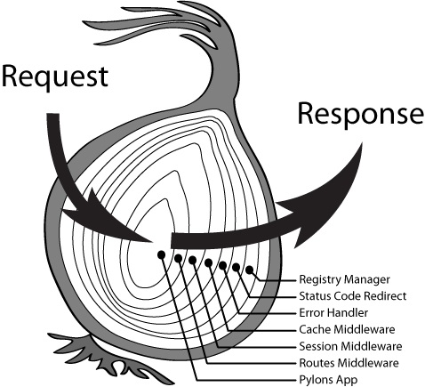

# 简易博客 - 路由 & 中间件

在[上一篇文章](./lesson2.md)中，我们实现了一个博文系统，虽然能用，但是非常简陋，存在大量可以继续优化的地方，这一篇文章就来对它进行优化一下，集成一下路由功能以及中间件系统，提升系统的拓展能力。

## 路由控制

在此前的实现中，路由功能是完全用 `if else` 实现的，这样做导致的问题就是，每次需要新增路由，都得添加一个 `else if` ，会让代码逻辑冗余度愈发严重，再者代码也不够直观，因此我们做的第一件事，就是对路由功能做一下优化。

### 路由设计

我们应该要设计一套可以通用的路由规则，写代码的时候，通过添加对应规则即可完成 `request => Controller` 之间的连通，每次请求路由都能根据路由表中的路由规则决定将请求交由哪个 `Controller` 来处理，根据诸多优秀开源框架的路由设计，转换成代码最终期望实现的效果应该要像这样：

```js
// 实例化路由对象
const router = new Router();

// 博客首页，接收 get 请求
router.get('/', indexController);

// 博客详情，接收 get 请求
router.get('/detail/:id', detailController);

// 博客编辑页面请求
router.get('/edit(/:id)?', showEditPage);

// 博客编辑数据提交
router.post('/edit(/:id)?', submitBlog);

// 除此之外的都到 404
router.all('*', notFoundController);
```

可以看到，我们需要实现一个 `Router` 类，然后当实例化这个类的时候，就可以通过实例里的各个方法来设置以下路由规则：

- 博客首页要 `get` 请求 `/` 的时候才会进入 `indexController`。
- 博客详情要 `get` 请求 `/detail/:id` 的时候才会进入 `indexController`。
- 博客编辑页则要 `get` 或者 `post` 请求并且访问 `/edit(/:id)?`（ `?` 代表可以有 `/:id` 也可以没有 ）的时候才会进入 `editController`。
- 当前面的所有规则都没有命中，就去到 `notFoundController`。

### 路径处理

在实现我们的 `Router` 类之前，我们需要先实现一个 `pathToRegexp` 的功能，也就是将上面设置的路由规则，转成正则表达式，然后用来匹配 `req.url` ，这个业界有个很成熟的插件 [path-to-regexp](https://github.com/pillarjs/path-to-regexp) ，不过为了能让你们知道如何来实现这么个功能，所以还是简单实现了一个类似的方法：

```js
function pathToRegexp(rule) {
  const keys = [];
  const regExpStr = rule
    .replace(/\(/, '(?:') // 将 (xxx) 转换成 (?:xxx)，以防被捕获
    .replace(/\/:(\w+)/, (_, k) => {  // 将 /:id 转成 /(\\w+)
      keys.push(k); // 将 id 这个字符塞入到 keys 中，以便后面匹配到的值跟 key 对得上
      return '/(\\w+)';
    })
    .replace(/\*/, '.*'); // 将 * 转换成 .*

  return {
    ruleRE: new RegExp(`^${regExpStr}$`), // 将上面转换后的正则字符，转换成正则
    keys,
  };
}
```

为了保证上面自己写的方法能够达到我们想要的效果，可以写几个测试方法来验证一下，Node 官方库中有一个叫 `assert` 的断言库，第一个入参如果是 `false` 的话，就会抛错，可以协助我们来验证方法。

```js
const assert = require('assert'); // Node 提供的断言库

// 测试详情
assert(pathToRegexp('/detail/:id').ruleRE.exec('/detail/123123'), '应该能匹配上详情地址');
assert(pathToRegexp('/detail/:id').keys[0] === 'id', '应该能收集到 id 字符');

// 测试编辑
assert(pathToRegexp('/edit(/:id)?').ruleRE.exec('/edit/123123'), '应该能匹配上编辑页地址');
assert(pathToRegexp('/edit(/:id)?').keys[0] === 'id', '应该能收集到 id 字符');
assert(pathToRegexp('/edit(/:id)?').ruleRE.exec('/edit'), '应该能匹配上编辑页地址');
assert(!pathToRegexp('/edit(/:id)?').ruleRE.exec('/editor/bb'), '应该不能匹配上错误的编辑页地址');

// 测试其他
assert(pathToRegexp('/').ruleRE.exec('/'), '应该能匹配上首页地址');
assert(pathToRegexp('*').ruleRE.exec('/editor/bb'), '应该能匹配上所有地址');
```

### 实现 Router 类

路由类的实现如下，我们提供一个 `register` 方法来用于注册路由规则，然后相关请求类型的方法直接全部都在 `register` 上封装一层即可，然后统一在 `register` 中将传入的路由规则保存到数组当中。

```js
class Router {
  constructor() {
    this.rules = [];

    // 支持的请求类型
    this.supportMethods = [ 'get', 'post', 'options', 'delete', 'put' ];

    // 给 Router 对象加上请求类型的方法
    this.supportMethods.forEach(method => {
      this[method] = this.register.bind(this, [ method ]);
    });

    // 加上 all 方法，代表支持所有请求
    this.all = this.register.bind(this, this.supportMethods);
  }

  // 注册路由
  register(methods, rule, controller) {
    // 将每个规则塞入数组
    this.rules.push({
      methods,
      controller,
      ...pathToRegexp(rule),
    });
  }
}
```

实现添加路由的功能之后，我们这个路由对象还需要有一个方法，用来接收请求。

```js
class Router {
  ...

  handle(req, res) {
    // 获取 pathname
    const pathname = url.parse(req.url).pathname;

    // 遍历保存的路由规则
    for (let i = 0; i < this.rules.length; i++) {
      const { methods, ruleRE, keys, controller } = this.rules[i];

      // 当请求类型匹配，同时能匹配上路由规则的时候才继续
      const result = methods.includes(req.method.toLowerCase()) && ruleRE.exec(pathname);
      if (!result) {
        continue;
      }

      // 如果规则中是 /:id ，这里就将匹配到的值，跟 id 对应起来
      const params = {};
      keys.forEach((item, index) => {
        params[item] = result[index + 1];
      });

      // 调用保存的 controller ，然后退出循环
      controller(req, res, { params, pathname });
      break;
    }
  }
}
```

然后在创建服务的时候，通过 `handle` 方法，将请求传输给 `router` 即可

```js
const server = http.createServer((req, res) => {
  router.handle(req, res);
});
```

将以上路由实现之后，也需要改一下原来的代码，但是基本上改动不大，因为 `params` 已经在 `handle` 方法里获取好了，因此就不需要原来的 `getIdFromPathname` 方法了，比如博客详情页，就改成这样即可

```js
// 博客详情页
function detailController(req, res, { params }) {
  const id = params.id;
  const blog = id && blogs.find(blog => blog.id === id);
  
  ...
}
```

如果我们想要再增加个删除的路由功能，也就变得很简单了，直接用 router 添加个规则即可

```js
router.get('/blog/delete/:id', (req, res, { params }) => {
  // delete some blog
});
```

这样，我们就有了一个更易于使用的路由功能了，不需要手动写一堆的 `if else` 来判断路径又判断请求类型了。

## 中间件系统

当完成了路由功能之后，我们再回过来看一下这个博客系统，我们在每一个 `Controller` 中，想要输出数据都得写响应头，写相应数据，如果需要拿请求数据进行处理，都得调用获取请求数据的方法来拿数据，如果请求数据不符合我们的期望，又可能还得调用其他 `Controller`（ 比如 404 ），当写多了 Controller 之后，就会发现代码会越来越冗余，所以我们可以把这些很通用性的功能，都可以都抽离出来。

而怎么抽离呢？我们可以设计一套中间件系统，将这些通用操作，分解成一个又一个的中间件，连路由以及 Controller 也可以当成是中间件的一环，当请求经过层层中间件到达我们的 `Controller` 的时候，一切准备工作都已经被中间件做好了，在 `Controller` 中可以更专注于业务逻辑。

### 系统设计

参考 [Koa](https://koajs.com/) 的中间件设计，我们的中间件也设计成类似的洋葱模型



洋葱模型的意思是，当外部请求进来，会经过一层一层的中间件处理，每一层的中间件处理完就会丢给下一层中间件，然后在某一层中间件中处理完之后，如果不想继续往下，就直接丢出 response ，而 response 也会层层经过中间件。

### 具体实现

前面实现路由的时候，在 http 请求回调中直接调用 `router.handle` 来接收请求处理，当引入中间件系统之后，路由也将成了其中一个中间件，因此接收请求的就应该改成了中间件系统。具体实现如下，代码量其实很少。

```js
// 中间件系统
const app = {
  middleware: [],

  use(mid) {
    // 添加一个中间件，要求传入的中间件都是 async 的
    this.middleware.push(mid);
  },

  async handle(req, res) {
    // 创建个上下文对象
    const context = { req, res };

    // 开始对中间件的遍历
    let i = 0;
    const traverseMid = async () => {
      // 拿到当前遍历到的中间件
      const mid = this.middleware[i++];
      if (!mid) return;

      // 将当前上下文对象传入中间件，并且传入执行下一个中间件的 async 方法
      await mid(context, traverseMid);
    };

    await traverseMid();
  },
};

const server = http.createServer((req, res) => app.handle(req, res));
```

可以看到，中间件系统简单来看就两个方法，一个是塞入中间件，一个是用来接收请求后开始中间件的执行流程。

然后写个 demo 测试一下是否运行正常

```js
app.use(async (ctx, next) => {
  console.info('1 start');
  await next();
  console.info('1 end');
});

app.use(async (ctx, next) => {
  console.info('2 start');
  await next();
  console.info('2 end');
});

app.handle();
```

如果看到控制台输出

```
1 start
2 start
2 end
1 end
```

说明这个中间件系统就已经可以正常工作了。由于中间件完全是围绕着 `async/await` 来运作的，因此接下来除了编写相关中间件之外，还得将所有 `Controller` 都改成 `async` 的。

### 编写中间件

当中间件系统完成之后，我们就可以来编写中间件系统了，大概有以下几个中间件

```js
app.use(startHandle);   // 请求开始
app.use(errorHandle);   // 错误处理
app.use(bodyHandle);    // 请求/响应数据处理
app.use(router.handle); // 路由功能
```

#### 请求开始

这个中间件是请求的开始，会往中间件系统提供的上下文对象 `context` 中插入一些属性供后面的中间件使用。同时，在后面的中间件全部执行完的时候，进行真正的数据响应。

由于只是示例 demo，因此只关注基本实现，像 cookie 之类的都先忽略，有兴趣的自行完善即可。请求开始的代码比较多，因为可以说是核心的请求和响应的处理。

```js
// 请求开始
async function startHandle(ctx, next) {
  const startTime = Date.now();
  ctx.status = null; // 用于记录响应码
  ctx.body = ''; // 用于记录响应数据
  ctx.method = ctx.req.method.toLowerCase(); // method 转成小写
  ctx.pathname = url.parse(ctx.req.url).pathname; // 给上下文对象添加个 pathname 的属性
  ctx.type = 'html'; // 响应类型，默认为 html
  const mimes = { html: 'text/html', json: 'application/json' };

  await next();

  // 如果没有设置 body ，也没有设置 status ，默认为 404
  ctx.status = ctx.status ? ctx.status : (ctx.body ? 200 : 404);
  // 写状态码
  ctx.res.writeHead(ctx.status, { 'Content-Type': `${mimes[ctx.type]};charset=utf-8` });
  // 写响应
  if (ctx.body && ctx.body instanceof stream.Stream) {
    // body 可以直接设置为流
    ctx.body.pipe(ctx.res);
  } else {
    // 普通 json 对象或者字符串
    let body = '';
    try {
      // 防止 stringify 出错，start 中不能出错，因为 errorHandle 在该中间件后面
      body = ctx.body && ((typeof ctx.body === 'string' || ctx.body instanceof Buffer)
        ? ctx.body : JSON.stringify(ctx.body));
    } catch (e) {
      body = '';
      console.error(e);
    }
    ctx.res.end(body || String(ctx.status));
  }

  // 打印 accesslog
  console.info(`request ${ctx.pathname} ${ctx.status}, cost ${Date.now() - startTime}ms`);
}
```

#### 错误处理

用于捕获后续中间件中处理的所有错误，`catch` 住之后直接抛 500 即可。

```js
// 错误处理
async function errorHandle(ctx, next) {
  await next().catch(e => {
    console.error(e);
    ctx.status = 500;
    ctx.body = e.message;
  });
}
```

#### 请求数据处理

用于获取请求数据，并且将请求数据解析后放在上下文对象中。

```js
async function bodyHandle(ctx, next) {
  ctx.requestBody = ctx.req.method === 'POST'
    ? await getDataFromReq(ctx.req)
    : {};

  await next();
}
```

#### 路由处理

最后一个中间件，就是我们的路由了，在上面已有代码中做一下小改造即可

```js
...
  async handle(ctx, next) {
    // 获取 pathname 改成从 ctx 中获取
    const pathname = ctx.pathname;
    ...
      // 将 params 改成保存到上下文对象
      ctx.params = params;
      // 给 controller 传入上下文对象 ctx
      await controller(ctx);
    ...
    await next();
  }
...
```

由于所有 Controller 的入参改了，再加上此时我们可以完全不关注 404 的问题了（ 只要不设置 body 和 status 就自动 404 了 ） 所以我们的路由也要做一下响应的调整。

比如博客首页就得调整成

```js
// 博客首页
function indexController(ctx) {
  ctx.body = '<h1>博客列表</h1>';

  if (blogs.length) {
    // 有博客的情况
    const html = blogs
      .map(blog => {
        // 博客标题
        const blogHtml = `<a href="/detail/${blog.id}">${escapeHtml(blog.title)}</a>`;
        // 博客编辑
        const editHtml = `<a href="/edit/${blog.id}">编辑</a>`;
        // 合并 html
        return `<p>${blogHtml} &nbsp;&nbsp; ${editHtml}</p>`;
      })
      .join('');

    ctx.body += html;
  } else {
    // 没有博客的情况
    ctx.body += '<p>暂无博客</p>';
  }

  // 结束响应，顺便加个添加博客入口
  ctx.body += '<a href="/edit">添加博客</a>';
}
```

详情页则调整成

```js
// 博客详情页
function detailController(ctx) {
  const id = ctx.params.id;
  const blog = id && blogs.find(blog => blog.id === id);
  if (blog) {
    ctx.body = `<h1>${escapeHtml(blog.title)}</h1>${escapeHtml(blog.content)}`;
  }
}
```

博客编辑接口则调整成

```js
// 博客编辑接口
let uniqId = 0;
async function submitBlog(ctx) {
  const id = ctx.params.id;
  let blog = id && blogs.find(blog => blog.id === id);

  if (blog && blog.id) {
    // 有 id ，说明是更新博文
    blog.title = ctx.requestBody.title;
    blog.content = ctx.requestBody.content;
  } else {
    // 无 id，说明是添加新博文
    blog = {
      id: `${Date.now()}${uniqId++}`, // 以时间戳作为 id
      title: ctx.requestBody.title,
      content: ctx.requestBody.content,
    };

    blogs.push(blog);
  }

  ctx.type = 'json';
  ctx.body = { id: blog.id };
}
```

## 结尾

至此，我们的博客系统，就有了一套更好用的路由功能，以及很方便做通用处理的中间件系统。此时，我们就可以对代码做很好的划分了，可以写个 `router.js` 专门用来放路由规则，然后建个 `controller` 目录专门用来放控制器。再建个 `middleware` 目录专门用来放所有的中间件。

这样，整个系统的逻辑将很清晰明了，也会更容易维护。

---

可以直接点击 [这里](./demo/httptest.3.js) 看到本文涉及的所有代码。单测则在 [这里](./demo/__tests__/httptest.3.js) 可以看到